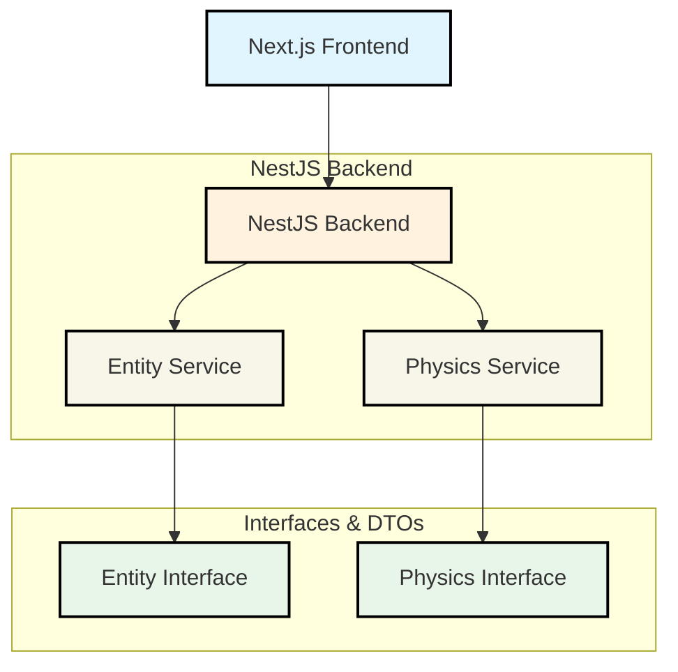

# NestJS Backend Technical Specifications

## Overview
This document outlines the technical specifications for migrating game engine components from a Next.js frontend to a NestJS backend. The architecture follows modern software engineering principles with clear separation of concerns, dependency injection patterns, and standardized data transfer mechanisms.

## Architecture Diagram



## Service Implementations

### Entity Component System (ECS)
The ECS service manages game entities and their components.

#### Interfaces:
```typescript
// src/entity/entity.interface.ts
export interface Entity {
  id: string;
  name: string;
  position: { x: number; y: number };
  active: boolean;
}
```

#### DTOs:
```typescript
// src/entity/entity.dto.ts
export class CreateEntityDto {
  name: string;
  position: { x: number; y: number };
  active: boolean;
}

export class UpdateEntityDto {
  id: string;
  name?: string;
  position?: { x: number; y: number };
  active?: boolean;
}
```

#### Service Implementation:
```typescript
// src/entity/entity.service.ts
@Injectable()
export class EntityService {
  private entities: Map<string, Entity> = new Map();

  create(createEntityDto: CreateEntityDto): Entity {
    // Implementation details...
  }

  findAll(): Entity[] {
    return Array.from(this.entities.values());
  }

  findOne(id: string): Entity | undefined {
    return this.entities.get(id);
  }

  update(id: string, updateEntityDto: UpdateEntityDto): Entity | undefined {
    // Implementation details...
  }

  remove(id: string): boolean {
    return this.entities.delete(id);
  }
}
```

### Physics Simulation
The physics service handles physical interactions using Cannon.js.

#### Interfaces:
```typescript
// src/physics/physics.interface.ts
export interface PhysicsBody {
  id: string;
  position: { x: number; y: number; z: number };
  velocity: { x: number; y: number; z: number };
  mass: number;
  shape: 'box' | 'sphere' | 'plane';
}

export interface PhysicsWorld {
  addBody(body: PhysicsBody): void;
  removeBody(id: string): void;
  step(deltaTime: number): void;
  getBody(id: string): PhysicsBody | undefined;
}
```

#### DTOs:
```typescript
// src/physics/physics.dto.ts
export class CreatePhysicsBodyDto {
  position: { x: number; y: number; z: number };
  velocity: { x: number; y: number; z: number };
  mass: number;
  shape: 'box' | 'sphere' | 'plane';
}

export class UpdatePhysicsBodyDto {
  id: string;
  position?: { x: number; y: number; z: number };
  velocity?: { x: number; y: number; z: number };
  mass?: number;
}
```

#### Service Implementation:
```typescript
// src/physics/physics.service.ts
@Injectable()
export class PhysicsService {
  private bodies: Map<string, PhysicsBody> = new Map();

  create(createPhysicsBodyDto: CreatePhysicsBodyDto): PhysicsBody {
    // Implementation details...
  }

  findAll(): PhysicsBody[] {
    return Array.from(this.bodies.values());
  }

  findOne(id: string): PhysicsBody | undefined {
    return this.bodies.get(id);
  }

  update(id: string, updatePhysicsBodyDto: UpdatePhysicsBodyDto): PhysicsBody | undefined {
    // Implementation details...
  }

  remove(id: string): boolean {
    return this.bodies.delete(id);
  }

  step(deltaTime: number): void {
    // In a real implementation with Cannon.js:
    // - Step the physics world
    // - Update body positions/velocities based on forces
  }
}
```

## API Endpoint Design

### Entity Management Endpoints
- `POST /entities` - Create new entity
- `GET /entities` - Retrieve all entities  
- `GET /entities/:id` - Retrieve specific entity
- `PUT /entities/:id` - Update existing entity
- `DELETE /entities/:id` - Remove entity

### Physics Management Endpoints
- `POST /physics/bodies` - Create new physics body
- `GET /physics/bodies` - Retrieve all bodies
- `GET /physics/bodies/:id` - Retrieve specific body
- `PUT /physics/bodies/:id` - Update existing body
- `DELETE /physics/bodies/:id` - Remove body
- `POST /physics/step` - Step physics simulation

## Dependency Injection Configuration

### Module Setup:
```typescript
// src/app.module.ts
import { Module } from '@nestjs/common';
import { EntityService } from './entity/entity.service';
import { PhysicsService } from './physics/physics.service';

@Module({
  imports: [],
  controllers: [],
  providers: [EntityService, PhysicsService],
  exports: [EntityService, PhysicsService],
})
export class AppModule {}
```

### Service Registration:
Services are registered in the module with proper injection patterns:

```typescript
// src/main.ts
import { NestFactory } from '@nestjs/core';
import { AppModule } from './app.module';

async function bootstrap() {
  const app = await NestFactory.create(AppModule);
  await app.listen(3000);
}
bootstrap();
```

## Data Transfer Mechanisms

### REST API Design:
All communication between Next.js frontend and NestJS backend will be through RESTful HTTP endpoints with JSON payloads.

#### Request/Response Format:
```json
{
  "id": "string",
  "name": "string", 
  "position": {
    "x": number,
    "y": number
  },
  "active": boolean
}
```

### WebSocket Support (Future):
WebSocket connections will be implemented for real-time communication between frontend and backend.

## Configuration Guidelines

### Environment Variables:
- `PORT` - Server port (default: 3000)
- `NODE_ENV` - Application environment (development/production)

### NestJS Configuration:
```typescript
// src/app.module.ts
@Module({
  imports: [],
  controllers: [],
  providers: [EntityService, PhysicsService],
  exports: [EntityService, PhysicsService],
})
export class AppModule {}
```

## Testing Strategy

### Unit Tests:
- Service methods (create, findAll, findOne, update, remove)
- DTO validation logic
- Interface compliance

### Integration Tests:
- End-to-end API endpoint testing
- Service interaction verification
- Data flow validation between services

## Performance Considerations

### Memory Management:
- Efficient Map-based data structures for entity storage
- Proper cleanup of unused entities and physics bodies
- Garbage collection optimization

### Processing Efficiency:
- Batch processing capabilities for large datasets
- Asynchronous operations where appropriate
- Caching strategies for frequently accessed data

## Security Aspects

### Authentication & Authorization:
- JWT token validation for API access
- Role-based permissions for sensitive endpoints
- Input sanitization to prevent injection attacks

### Data Protection:
- Secure transmission via HTTPS (when deployed)
- Proper error handling without exposing internal details
- Rate limiting for API endpoints

## Future Enhancements

### Advanced Physics Simulation:
- Integration with Cannon.js for realistic physics
- Multi-threading support for complex simulations
- Custom physics engine extensions

### Scalability Features:
- Load balancing configuration
- Database integration (PostgreSQL/MongoDB)
- Caching layer implementation (Redis)

### Monitoring & Logging:
- Comprehensive logging system
- Performance metrics collection
- Error tracking and alerting mechanisms